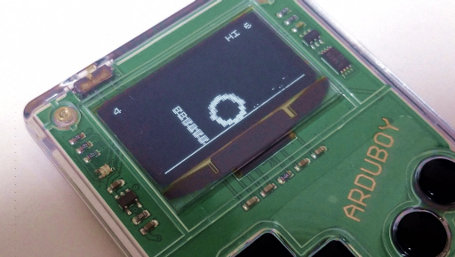
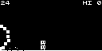
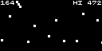
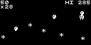

# crisp-game-lib-arduboy

A customized version of [crisp-game-lib-portable](https://github.com/abagames/crisp-game-lib-portable) for [Arduboy&trade;](https://www.arduboy.com/).

## Available Games

[Play games on the emulator.](https://obono.github.io/crisp-game-lib-arduboy/repo_viewer.html)

### [Survivor](cglabSurvivor/)

### [Pin Climb](cglabPinClimb/)

### [Ball Tour](cglabBallTour/)

### Common Operation

* Press down to toggle sound on/off in title screen.
* Press A or B to (re)start game.

## How to build

1. [Setup Arduboy developing environment](https://www.arduboy.com/quick-start#programming).
    * Sketches in this repository depend on only [Arduboy2 library](https://github.com/MLXXXp/Arduboy2).
2. Copy [./lib/*](lib/) files to the directory you want to build.
3. Verify and upload *.ino file.

## Code reference

* [Functions and variables](https://obono.github.io/crisp-game-lib-arduboy/ref_document/cglab_8c.html)
* [Structs and macros](https://obono.github.io/crisp-game-lib-arduboy/ref_document/cglab_8h.html)
* [2d vector functions](https://obono.github.io/crisp-game-lib-arduboy/ref_document/vector_8c.html) ([macros](https://obono.github.io/crisp-game-lib-arduboy/ref_document/vector_8h.html))

## License

These codes are licensed under [MIT License](LICENSE).

## Acknowledgments

Special thanks to [ABA games](http://www.asahi-net.or.jp/~cs8k-cyu/).
He is a genius game creator!! :thumbsup:
